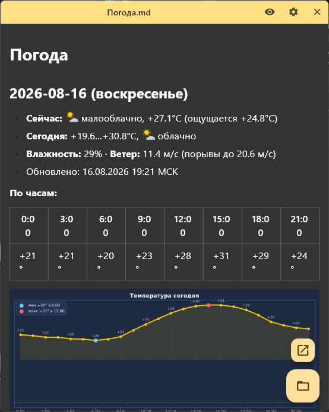

# StickyNotesViewer

Turn Markdown files into sticky notes pinned to your Windows desktop. Each note is its own frameless window — drag it anywhere, resize it, and it stays put across restarts.



## Features

- **Multi-window** — every note lives in its own frameless window, so you can arrange them freely around your screen.
- **Native file dialog** — open `.md` / `.markdown` files through the Windows picker (implemented with `IFileOpenDialog`, so the dialog stays modal and focused).
- **Dark Markdown rendering** — selectable text, styled for dark backgrounds.
- **Live reload** — optionally watch the file and re-render automatically when it changes on disk.
- **Obsidian-friendly** — supports local image paths and Obsidian-style image sizing (`![[image.png|200]]`).
- **Persistence** — window position, size, and file path are remembered; notes are restored on the next launch.
- **Localization** — English and Russian.
- **Distraction-free chrome** — the title bar collapses to a thin strip when a note isn't focused or hovered.

## How to use

1. Launch the app. An empty note appears (or your saved notes are restored).
2. Hover over a note to reveal the buttons, then click the folder icon to pick a Markdown file.
3. Drag the top strip to move a note; drag any edge to resize it.
4. The eye icon toggles live file watching.
5. The gear icon opens settings (language).
6. The **×** button removes the note from the app — it does **not** delete the file on disk.

## Building

Requirements:

- [Flutter](https://flutter.dev) 3.x with Windows desktop support enabled.

```bash
flutter pub get
flutter run -d windows          # debug
flutter build windows --release # release
```

`build_release.bat` builds the release and copies it to `F:\Soft\StickyNotesViewer` (adjust the target path in the script if needed).

## Project structure

```
lib/
  main.dart                 # entry point — dispatches manager vs viewer
  manager_app.dart          # hidden manager: restores / creates note windows
  viewer_app.dart           # a single note window
  notes_store.dart          # persistence (positions, sizes, file paths)
  windows_file_dialog.dart  # native IFileOpenDialog via FFI
  widgets/                  # custom title bar and config dialog
third_party/
  desktop_multi_window/     # patched multi-window + frameless window plugin
```

## Tech notes

- Multi-window and frameless windows are handled by a patched `desktop_multi_window` (see `third_party/`).
- Window resizing is delegated to the native Windows resize loop for reliability.
- The file picker uses the modern `IFileOpenDialog` COM API rather than the legacy `GetOpenFileNameW`, so the dialog keeps focus and stays modal over frameless windows.

## License

[MIT](LICENSE)
